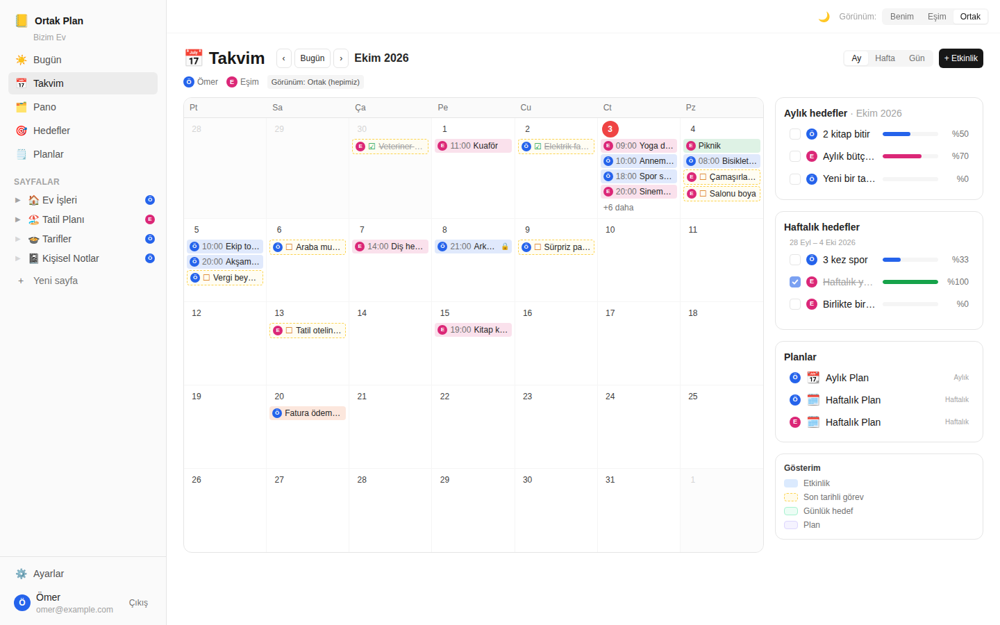
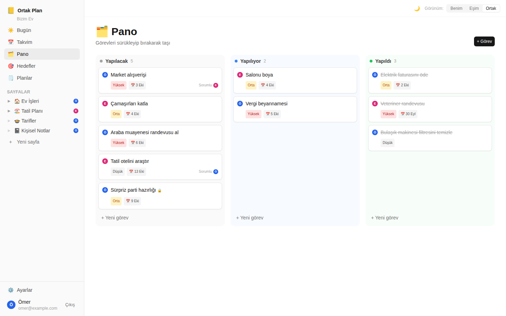
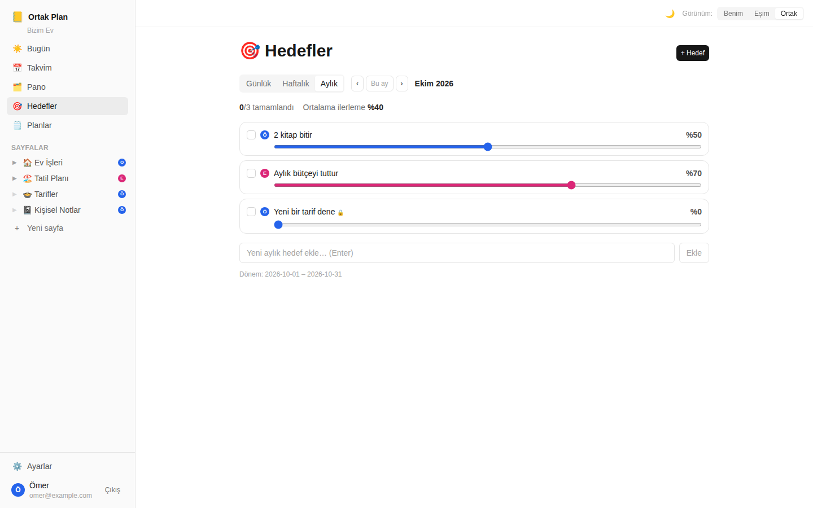
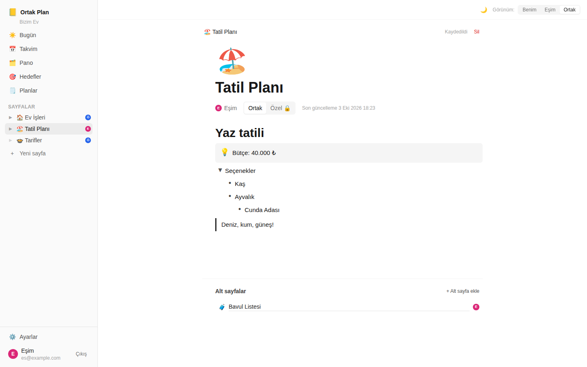

# 📒 Ortak Plan

Eşinle birlikte kullanmak için Notion benzeri bir planlayıcı. Günlük, haftalık ve aylık
planlarınızı, hedeflerinizi, yapılacaklarınızı ve takviminizi tek yerde toplar.

Her kişinin kendi takvimi ve planları vardır. İstediğiniz an **Ortak** görünüme geçip
ikinizin kayıtlarını aynı takvimde görebilirsiniz. Her kayıt, sahibinin renginde küçük
bir harfle işaretlenir (ör. **Ö** = Ömer, **E** = Eşim).



## Özellikler

- **İki (veya daha fazla) kullanıcı, tek ev:** Biri hesap açar, diğeri davet koduyla aynı
  eve katılır.
- **Benim / Eşim / Ortak görünümü:** Üst çubuktaki seçici tüm ekranlara uygulanır.
  - *Benim*: yalnızca benim kayıtlarım
  - *Eşim*: yalnızca eşimin paylaştığı kayıtlar
  - *Ortak*: ikimizin kayıtları birlikte, her biri sahibinin harfiyle
- **Ortak / Özel:** Her kayıt varsayılan olarak ortaktır; *Özel 🔒* yaptığınız kayıtları
  eşiniz hiçbir görünümde göremez.
- **Takvim (Ay / Hafta / Gün):** Ayın tamamı normal bir takvim gibi görünür. Etkinlikler,
  son tarihli görevler, günlük hedefler ve planlar hücrelerde; ayın ve haftanın hedefleri
  takvimin yanında listelenir. Bir güne tıklayıp etkinlik eklenir, gün numarasına
  tıklayınca o günün ayrıntılı görünümü açılır. Telefonda hücrelerde kişilerin harfleri
  gösterilir, güne dokununca o günün listesi açılır.
- **Bugün paneli:** Bugünün etkinlikleri ve görevleri, haftanın kalan etkinlikleri ve
  görevleri, günlük/haftalık/aylık hedefler ve planlar, görev durumu özeti.
- **Pano (Kanban):** *Yapılacak / Yapılıyor / Yapıldı* sütunları, sürükle-bırak. Eşiniz de
  ortak görevlerinizi taşıyabilir.
- **Hedefler:** Günlük, haftalık ve aylık hedefler; ilerleme çubuğu (%), tamamlandı işareti,
  dönemler arası gezinme.
- **Planlar:** Her gün/hafta/ay için plan sayfası (hazır şablonla).
- **Notion benzeri sayfa düzenleyici:** `/` komut menüsü (başlık, yapılacak, madde, numaralı
  liste, açılır liste, alıntı, bilgi kutusu, kod, ayırıcı), Enter / Backspace kısayolları,
  **Tab / Shift+Tab ile liste girintisi**, açılır listelerin açık/kapalı durumu kaydedilir,
  emoji simgesi, iç içe alt sayfalar, otomatik kaydetme.
- **Karanlık mod** (üst çubuktaki 🌙 / ☀️ düğmesi) ve mobil uyumlu arayüz.
- Saat dilimine duyarlı takvim (varsayılan *Europe/Istanbul*; tarayıcının saat dilimi
  kullanılır).

| Pano | Hedefler | Sayfa düzenleyici |
| --- | --- | --- |
|  |  |  |

## Kurulum ve çalıştırma

Gereksinim: **Node.js 22.5 veya üzeri** (yerleşik `node:sqlite` kullanılır, ayrı bir
veritabanı kurmanız gerekmez).

```bash
npm install      # bağımlılıkları kurar
npm run seed     # örnek verilerle veritabanını (yeniden) oluşturur
npm run dev      # API (3001) ve arayüzü (5173) birlikte başlatır
```

Tarayıcıda **http://localhost:5173** adresini açın.

### Örnek hesaplar

| Kişi | E-posta | Şifre |
| --- | --- | --- |
| Ömer (Ö) | `omer@example.com` | `123456` |
| Eşim (E) | `es@example.com` | `123456` |

> `npm run seed` veritabanındaki **tüm verileri siler** ve bugüne göre örnek veriler
> (bu hafta sonu ikinizin planları, görevler, hedefler, plan sayfaları) oluşturur.

### Üretim (production)

```bash
npm run build    # arayüzü client/dist klasörüne derler
npm start        # API + derlenmiş arayüz: http://localhost:3001
```

Ortam değişkenleri (isteğe bağlı):

| Değişken | Varsayılan | Açıklama |
| --- | --- | --- |
| `PORT` | `3001` | Sunucu portu |
| `DB_PATH` | `server/data/app.db` | SQLite veritabanı dosyası |
| `JWT_SECRET` | geliştirme anahtarı | Oturum imzalama anahtarı — üretimde mutlaka değiştirin |
| `APP_TIMEZONE` | `Europe/Istanbul` | İstemci saat dilimi göndermediğinde kullanılan saat dilimi |

## Eşinizle eşleşme (davet kodu)

1. Birinci kişi **Kayıt ol** sayfasından davet kodu girmeden hesap açar; kendisi için yeni
   bir "ev" oluşturulur.
2. **Ayarlar** sayfasında **Davet kodu** görünür (Kopyala düğmesiyle kopyalanabilir;
   gerekirse *Yeniden oluştur* ile yenilenir).
3. Eşi **Kayıt ol** sayfasında adını, e-postasını, şifresini, isterse baş harfini ve rengini
   girer, **Davet kodu** alanına bu kodu yazar.
4. Artık ikiniz aynı evdesiniz: *Ortak* görünümde birbirinizin paylaştığı her şeyi
   görürsünüz. Baş harf ve renk sonradan Ayarlar'dan değiştirilebilir.

## Proje yapısı

```
.
├── package.json          # npm workspaces + kök komutlar (dev, build, start, seed, test, e2e)
├── docs/
│   ├── API.md            # mimari ve API sözleşmesi (sunucu ↔ istemci)
│   └── screenshots/
├── server/               # Express 5 + node:sqlite API
│   ├── src/
│   │   ├── index.js      # sunucu girişi (üretimde client/dist'i de sunar)
│   │   ├── app.js        # Express uygulaması
│   │   ├── db.js         # şema + açılışta veri düzeltme
│   │   ├── seed.js       # örnek veriler
│   │   ├── routes/       # auth, household, events, tasks, goals, pages, calendar, dashboard
│   │   ├── services/     # sorgular (görünürlük / kapsam kuralları)
│   │   └── lib/          # tarih & saat dilimi, doğrulama, erişim
│   └── test/             # node:test + supertest testleri
├── client/               # React 18 + Vite + TypeScript + Tailwind
│   └── src/
│       ├── pages/        # Bugün, Takvim, Pano, Hedefler, Planlar, Sayfa, Ayarlar, Giriş/Kayıt
│       ├── components/   # düzenleyici, modallar, rozetler, ortak bileşenler
│       ├── context/      # oturum, görünüm (Benim/Eşim/Ortak), sayfa ağacı
│       ├── api/          # tipli API istemcisi
│       └── lib/          # tarih, bloklar, tema yardımcıları
├── e2e/                  # Playwright uçtan uca testleri
└── playwright.config.ts
```

## Testler

```bash
npm test         # sunucu testleri (node:test) + istemci tip kontrolü (tsc)
npm run e2e      # Playwright uçtan uca testleri
```

`npm run e2e` kendi izole ortamını başlatır: ayrı bir veritabanını örnek verilerle
oluşturur, API'yi 3101, arayüzü 5180 portunda çalıştırır ve testleri *Europe/Istanbul*
saat diliminde Chromium ile koşar. Geliştirme veritabanınıza dokunmaz. İlk kez
çalıştırıyorsanız tarayıcıyı kurmanız gerekebilir: `npx playwright install chromium`.

Uçtan uca testlerin kapsadıkları: iki kişinin hafta sonu planları ve Ortak takvimde Ö/E
harfleri, Benim/Eşim görünümleri, özel kayıtların gizliliği, ay/hafta/gün görünümleri,
hedefler, plan sayfası düzenleme ve otomatik kaydetme (Tab girintisi, açılır liste
durumu), panoda sürükle-bırak (eşin taşıması dahil), davet koduyla kayıt, Bugün paneli ve
telefon görünümü.
